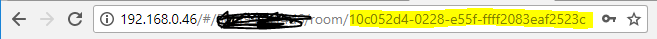

# MMM-Loxone
This is a module for the [MagicMirror²](https://github.com/MichMich/MagicMirror/).

MMM-Loxone connects to your Loxone Miniserver and lets it communicate to your MagicMirror².

This module **doesn't have its own visualisation**, but it exposes information like the room temperature and other states other modules can and will use.

## Security
This module doesn't transmit the defined credentials, it uses tokens to talk to your Loxone Miniserver.

**Please create an user for your MagicMirror² keep your personal credentials secure!** 

## Dependencies
* An Installation of [MagicMirror²](https://github.com/MichMich/MagicMirror/)
* LxCommunicator (will be installed via `npm install`)
* [when](https://github.com/cujojs/when) (will be installed via `npm install`)

## Installation
Navigate into your MagicMirror's `modules` folder:

````shell
cd ~/MagicMirror/modules
````

Clone this repository:

````shell
git clone https://github.com/idoodler/MMM-Loxone
````

Navigate to the new `MMM-Loxone` folder and install the node dependencies.
````shell
npm install
````

## Update the module
Navigate into the `MMM-Loxone` folder with `cd ~/MagicMirror/modules/MMM-Loxone` and get the latest code from github with git pull.

If you haven't changed the modules, this should work without any problems. Type `git status` to see your changes, if there are any, you can reset them with `git reset --hard`. After that, `git pull` should be possible.

## Using the module
To use this module, add the following configuration block to the modules array in the `config/config.js` file:
```js
var config = {
    modules: [
        {
            module: 'MMM-Loxone',
            config: {
                // See below for configurable options
            }
        }
    ]
}
```

## Configuration options
| Option                                | Description
|-------------------------------------- |-----------
| `host`                                | *required* Defines the Loxone Miniserver host. It can be an IP or your CloudDNS address<br><br>**Example:** `192.168.0.46` or `dns.loxonecloud.com/EEE00000000`<br><br>**Type:** `string`
| `user`                                | *required* Defines the Loxone Miniserver username.<br><br>**Type:** `string`
| `pwd`                                 | *required* Defines the Loxone Miniserver password.<br><br>**Type:** `string`
| `roomUuid`                            | *Optional* Defines the room of which the room temperature is displayed<br><br>**Info:** Modules like the default [currentWeather](https://github.com/MichMich/MagicMirror/tree/develop/modules/default/currentweather) and [MMM-forecast-io](https://github.com/idoodler/MMM-forecast-io) will display the indoor temperature, please refere to their documentation<br><br>**Type:** `string`
| `presence`                            | *Optional* If enabled this module will use the LightControllerV2 in the defined room to set the MagicMirror to sleep or wake it up<br><br>**Type:** `bool`<br><br>**Default:** `false`
| `showInfoNotifications`               | *optional* If info notifications should be shown.<br><br>**Type:** `bool`<br><br>**Default:** `true`
| `showErrorNotifications`              | *optional* If error notifications should be shown.<br><b r>**Type:** `bool`<br><br>**Default:** `true`
| `showSystemNotifications`             | *optional* If system notifications should be shown.<br><br>**Type:** `bool`<br><br>**Default:** `true`
| `showNotificationOfControlTypes`      | *optional* Defines, what controls are able to show notifications on your MagicMirror².<br><br>**Type:** `array`<br><br>**Default:** `[ "Intercom", "Alarm", "SmokeAlarm", "Sauna" ]`
| `allow3rdParty`                       | *optional* If 3rd Party modules are able to use this module to communicate with your Loxone Miniserver.<br><br>**Type:** `bool`<br><br>**Default:** `false`

## Display the room temperature
### Requirements
* The room needs to have at lease contain one Intelligent Room Controller
    * The first Intelligent Room Controller will be used if multiple are defined in one room
* `roomUuid` needs to be defined in the MMM-Loxone configuration in `config.js`
* [currentWeather](https://github.com/MichMich/MagicMirror/tree/develop/modules/default/currentweather) or [MMM-forecast-io](https://github.com/dmcinnes/MMM-forecast-io) must be installed and correctly configured to display the indoor room temperature

## Display Notifications
### Requirements
* You must define the `alert` module in your `config.json` file.

**Example:**
````js
{
	module: "alert"
}
````

### How to get the roomUuid
1. Open the Loxone Webinterface
2. Navigate to the room you want to display the room temperature
3. Copy the last path component displayed in your browsers URL-Bar<br>


## Developer notes
Notifications emitted by MMM-Loxone

| NotificationKey         | Description
|------------------------ |-----------
| `INDOOR_TEMPERATURE`    | Modules like the default [currentWeather](https://github.com/MichMich/MagicMirror/tree/develop/modules/default/currentweather) and [MMM-forecast-io](https://github.com/dmcinnes/MMM-forecast-io) will display the indoor temperature. Please implement this notification key if you want to display the indoor temperature in your module.<br><br>**Note:** ``roomUUID`` must be configured in your ``config.json``
| `USER_PRESENCE`         | Modules can use this notification to pause or resume your module.<br><br>**Example:** ``true`` if the User is present in the room, ``false`` if not.<br><br>**Payload:** ``bool``<br><br>**Note:** ``roomUUID`` and ``presence`` must be configured in your ``config.json``
| `LOXONE_STATE`          | Any state emitted by the Loxone Miniserver with its UUID and value. Ready to be used by any other module.<br><br>**Payload:** ``Number`` or ``String`` <br><br>**Note:** `allow3rdParty` must be configured in your ``config.json``
| `LOXONE_STRUCTURE_FILE` | The current structure file of the Loxone Miniserver as an Object `{}`.<br><br>**Payload:** ``Object``<br><br>**Note:** `allow3rdParty` must be configured in your ``config.json``
| `LOXONE_OSS`            | **O**ut **O**f **S**ervice status of the Loxone Miniserver.<br><br>**Example:** `true` if the Miniserver is rebooting, `false` if the Miniserver is up and running.<br><br>**Payload:** `bool`<br><br>**Note:** `allow3rdParty` must be configured in your ``config.json``

## License
The MIT License (MIT)

Copyright (c) 2018 David Gölzhäuser

Permission is hereby granted, free of charge, to any person obtaining a copy of this software and associated documentation files (the "Software"), to deal in the Software without restriction, including without limitation the rights to use, copy, modify, merge, publish, distribute, sublicense, and/or sell copies of the Software, and to permit persons to whom the Software is furnished to do so, subject to the following conditions:

The above copyright notice and this permission notice shall be included in all copies or substantial portions of the Software.

THE SOFTWARE IS PROVIDED "AS IS", WITHOUT WARRANTY OF ANY KIND, EXPRESS OR IMPLIED, INCLUDING BUT NOT LIMITED TO THE WARRANTIES OF MERCHANTABILITY, FITNESS FOR A PARTICULAR PURPOSE AND NONINFRINGEMENT. IN NO EVENT SHALL THE AUTHORS OR COPYRIGHT HOLDERS BE LIABLE FOR ANY CLAIM, DAMAGES OR OTHER LIABILITY, WHETHER IN AN ACTION OF CONTRACT, TORT OR OTHERWISE, ARISING FROM, OUT OF OR IN CONNECTION WITH THE SOFTWARE OR THE USE OR OTHER DEALINGS IN THE SOFTWARE.